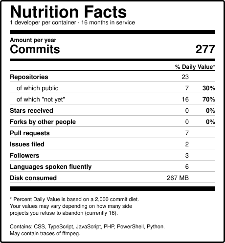

# Hey, I'm Andrej 👋

**Founder & designer @ [GRAPHIQ Studio](https://graphiq.art)**

I design and build end to end — brand systems, web products, and AI film.

→ [graphiq.art](https://graphiq.art)

  

Card is rebuilt daily from the live API by
<a href=".github/workflows/stats-card.yml">a workflow</a>. Every number is real, which is
the joke.
