# Hey, I'm Andrej 👋

**Founder & designer @ [GRAPHIQ Studio](https://graphiq.art)**

I design and build end to end — brand systems, web products, and AI film.

→ [graphiq.art](https://graphiq.art)

  

  

The stats card is rebuilt daily from the live API by
<a href=".github/workflows/stats-card.yml">a workflow</a> — every number is real, which is
the joke. There's a <a href="card.svg">nutrition label</a> version too. The character
sheet is from my own reference sheet, cropped and animated by
<a href="scripts/build-founder-card.mjs">a script</a>.
